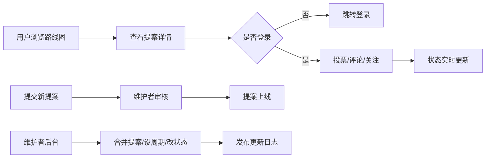

## 1. 产品概述

功能投票 Web 应用，服务于开源项目维护者收集社区对路线图的偏好。用户可浏览待开发功能、投票支持、提交提案；维护者可管理提案、设置投票周期、发布更新日志。

- 目标用户：开源项目维护者、社区贡献者、普通用户
- 核心价值：让社区声音主导项目发展方向，提升开源协作透明度

## 2. 核心 Features

### 2.1 用户角色

| 角色 | 注册方式 | 核心权限 |
|------|----------|----------|
| 访客 | 无需注册 | 浏览路线图、提案详情、排行榜、更新日志 |
| 普通用户 | GitHub OAuth / 邮箱 | 投票、撤票、评论、关注提案、提交新提案 |
| 维护者 | 特殊权限标记 | 合并提案、设置投票周期、置顶说明、标记状态、管理后台 |

### 2.2 Feature 模块

1. **公开路线图页**：展示待开发功能列表，支持按状态筛选
2. **提案详情页**：查看功能说明、适用场景、预计工作量、当前状态、投票记录
3. **提案提交页**：提交新提案，填写标题、描述、使用案例、预计工作量
4. **投票排行页**：按热度、近期增长、用户类型筛选，展示投票排名
5. **维护者后台**：管理提案、合并相似提案、设置投票周期、置顶公告
6. **更新日志页**：展示已完成事项，关联原始投票，说明取舍原因

### 2.3 页面详情

| 页面名称 | 模块名称 | 功能描述 |
|----------|----------|----------|
| 路线图页 | 导航栏 | 全局导航、登录入口、用户菜单 |
| 路线图页 | 状态筛选栏 | 按「规划中 / 投票中 / 开发中 / 已完成 / 暂不考虑」筛选 |
| 路线图页 | 提案卡片列表 | 展示提案标题、状态标签、票数、关注数、进度条 |
| 提案详情页 | 提案信息区 | 标题、描述、适用场景、预计工作量、创建时间 |
| 提案详情页 | 投票操作区 | 投票按钮、撤票按钮、关注按钮、分享按钮 |
| 提案详情页 | 评论区 | 用户评论列表、发表评论、回复功能 |
| 提案提交页 | 表单区 | 标题、描述、使用案例、预计工作量输入框 |
| 排行页 | 筛选栏 | 按热度 / 近期增长 / 用户类型筛选 |
| 排行页 | 排行榜列表 | 排名、提案名称、票数、涨跌幅、状态 |
| 维护者后台 | 提案管理 | 搜索、批量操作、合并提案、状态标记 |
| 维护者后台 | 周期设置 | 设置投票周期起止时间、公告置顶 |
| 更新日志页 | 时间轴 | 按时间倒序展示已完成事项、关联原提案、取舍说明 |

## 3. 核心流程

### 3.1 用户投票流程
用户进入路线图页 → 浏览提案列表 → 点击提案查看详情 → 登录后点击投票 → 投票成功，票数更新 → 可选择关注或评论

### 3.2 提案提交流程
用户点击「提交提案」→ 填写表单（标题、描述、使用案例）→ 提交审核 → 维护者审核通过 → 提案展示在路线图中

### 3.3 维护者管理流程
维护者进入后台 → 查看待审核提案 → 审核通过/驳回 → 可合并相似提案 → 设置投票周期 → 标记开发状态 → 完成后发布更新日志

## 4. 界面设计

### 4.1 设计风格
- **主色调**：深海蓝 (#0EA5E9)，代表开源社区的开放与专业
- **辅助色**：翡翠绿 (#10B981) 表示已完成，琥珀橙 (#F59E0B) 表示进行中，玫瑰红 (#F43F5E) 表示暂不考虑
- **中性色**：石板灰系列，深浅模式切换
- **按钮风格**：圆角 8px，悬停有微妙阴影和缩放效果
- **字体**：Space Grotesk（标题）+ JetBrains Mono（代码/数字）+ Geist（正文）
- **布局风格**：卡片式布局，清晰的信息层次， generous 留白
- **图标**：lucide-react 线性图标，统一 20px 尺寸

### 4.2 页面设计概览

| 页面名称 | 模块名称 | UI 元素 |
|----------|----------|----------|
| 路线图页 | Hero 区域 | 大标题、项目简介、统计数据（总提案数、总投票数、已完成数） |
| 路线图页 | 筛选栏 | Tab 切换，带动画下划线 |
| 路线图页 | 提案卡片 | 渐变边框、悬停上浮、进度条动画 |
| 提案详情页 | 信息区 | 双栏布局，左侧详情，右侧投票面板 |
| 提案详情页 | 投票按钮 | 大号按钮，点击有粒子动效 |
| 排行页 | 排行榜 | 前三名有特殊奖杯样式，排名数字有渐变背景 |
| 维护者后台 | 管理面板 | 表格布局，支持行内编辑，批量操作工具栏 |
| 更新日志页 | 时间轴 | 左侧时间线，右侧内容卡片，完成状态图标 |

### 4.3 响应式设计
- 桌面端（≥1280px）：多栏布局，侧边导航
- 平板（768px-1279px）：单栏或双栏，顶部导航折叠
- 移动端（<768px）：单列布局，底部 Tab 导航，卡片间距优化
- 触摸优化：按钮最小高度 44px，手势支持左滑取消投票

### 4.4 动效指引
- 页面加载：元素渐入，列表项依次滑入（stagger 动画）
- 投票交互：点击后按钮缩放 + 数字跳动 + 粒子扩散效果
- 状态切换：Tab 切换有滑动动画，卡片翻转动效
- 滚动：滚动时导航栏毛玻璃效果，提案卡片视差滚动
- 加载态：骨架屏脉冲动画，投票按钮旋转加载
