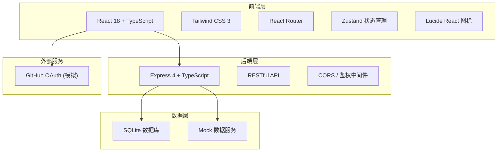
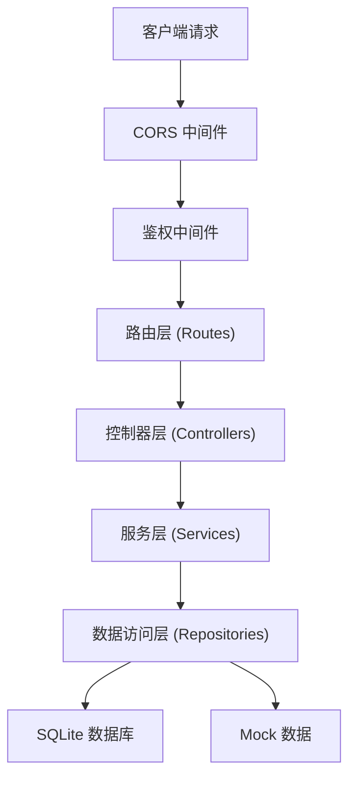
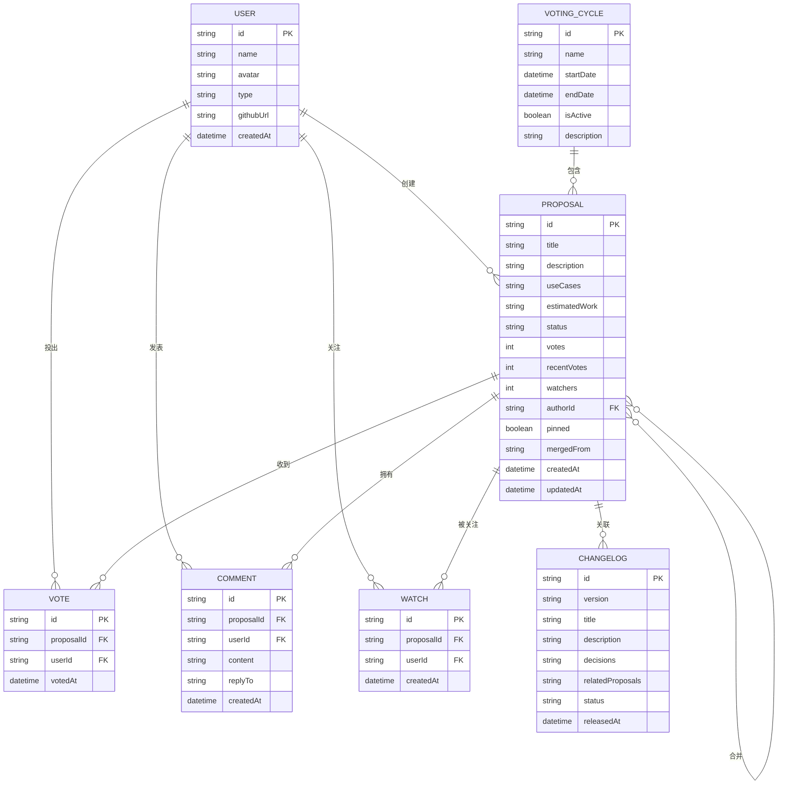

## 1. 架构设计



## 2. 技术选型

- **前端框架**：React 18 + TypeScript + Vite
- **样式方案**：Tailwind CSS 3 + CSS 变量
- **路由管理**：React Router v6
- **状态管理**：Zustand
- **图标库**：Lucide React
- **后端框架**：Express 4 + TypeScript (ESM)
- **数据库**：SQLite（开发环境）+ Mock 数据
- **初始化工具**：vite-init
- **包管理器**：npm（Windows 环境）

## 3. 路由定义

| 路由路径 | 页面名称 | 权限要求 |
|----------|----------|----------|
| `/` | 路线图首页 | 公开 |
| `/proposal/:id` | 提案详情页 | 公开 |
| `/submit` | 提交提案页 | 需登录 |
| `/ranking` | 投票排行榜 | 公开 |
| `/changelog` | 更新日志页 | 公开 |
| `/admin` | 维护者后台 | 需维护者权限 |
| `/login` | 登录页 | 公开 |

## 4. API 定义

```typescript
// 共享类型定义
type ProposalStatus = 'planning' | 'voting' | 'developing' | 'completed' | 'rejected';
type UserType = 'visitor' | 'user' | 'maintainer';

interface User {
  id: string;
  name: string;
  avatar: string;
  type: UserType;
  githubUrl?: string;
}

interface Proposal {
  id: string;
  title: string;
  description: string;
  useCases: string[];
  estimatedWork: string; // e.g., "2-3 人周"
  status: ProposalStatus;
  votes: number;
  recentVotes: number; // 近期增长
  watchers: number;
  authorId: string;
  author: User;
  comments: Comment[];
  createdAt: string;
  updatedAt: string;
  mergedFrom?: string[]; // 合并的提案 ID 列表
  pinned?: boolean;
}

interface Comment {
  id: string;
  userId: string;
  user: User;
  content: string;
  replyTo?: string;
  createdAt: string;
}

interface VoteRecord {
  proposalId: string;
  userId: string;
  votedAt: string;
}

interface ChangelogEntry {
  id: string;
  version: string;
  title: string;
  description: string;
  decisions: string; // 取舍原因说明
  relatedProposals: string[]; // 关联的提案 ID
  status: 'completed' | 'partial' | 'rejected';
  releasedAt: string;
}

interface VotingCycle {
  id: string;
  name: string;
  startDate: string;
  endDate: string;
  isActive: boolean;
  description: string;
}

// API 响应结构
interface ApiResponse<T> {
  data: T;
  message: string;
  success: boolean;
}

// 请求/响应类型
type GetProposalsParams = {
  status?: ProposalStatus;
  sortBy?: 'votes' | 'recent' | 'newest';
  userType?: UserType;
  page?: number;
  limit?: number;
};

type SubmitProposalRequest = {
  title: string;
  description: string;
  useCases: string[];
  estimatedWork: string;
};

type VoteRequest = {
  proposalId: string;
  userId: string;
};

type CommentRequest = {
  proposalId: string;
  content: string;
  replyTo?: string;
};
```

## 5. 服务器架构



### 目录结构
```
api/
├── src/
│   ├── controllers/      # 业务逻辑控制器
│   │   ├── proposalController.ts
│   │   ├── userController.ts
│   │   ├── voteController.ts
│   │   ├── commentController.ts
│   │   └── adminController.ts
│   ├── services/         # 业务服务层
│   │   ├── proposalService.ts
│   │   ├── voteService.ts
│   │   └── authService.ts
│   ├── repositories/     # 数据访问层
│   │   ├── proposalRepository.ts
│   │   ├── userRepository.ts
│   │   └── mockData.ts
│   ├── middleware/       # 中间件
│   │   ├── auth.ts
│   │   └── cors.ts
│   ├── routes/           # 路由定义
│   │   ├── proposals.ts
│   │   ├── votes.ts
│   │   ├── comments.ts
│   │   ├── admin.ts
│   │   └── user.ts
│   ├── types/            # 类型定义
│   │   └── index.ts
│   └── server.ts         # 服务入口
└── package.json
```

## 6. 数据模型

### 6.1 ER 图



### 6.2 DDL 语句

```sql
-- 用户表
CREATE TABLE IF NOT EXISTS users (
  id TEXT PRIMARY KEY,
  name TEXT NOT NULL,
  avatar TEXT NOT NULL,
  type TEXT NOT NULL DEFAULT 'user', -- 'visitor', 'user', 'maintainer'
  github_url TEXT,
  created_at DATETIME DEFAULT CURRENT_TIMESTAMP
);

-- 提案表
CREATE TABLE IF NOT EXISTS proposals (
  id TEXT PRIMARY KEY,
  title TEXT NOT NULL,
  description TEXT NOT NULL,
  use_cases TEXT NOT NULL, -- JSON array
  estimated_work TEXT NOT NULL,
  status TEXT NOT NULL DEFAULT 'planning', -- 'planning', 'voting', 'developing', 'completed', 'rejected'
  votes INTEGER NOT NULL DEFAULT 0,
  recent_votes INTEGER NOT NULL DEFAULT 0,
  watchers INTEGER NOT NULL DEFAULT 0,
  author_id TEXT NOT NULL,
  pinned INTEGER NOT NULL DEFAULT 0,
  merged_from TEXT, -- JSON array of proposal IDs
  voting_cycle_id TEXT,
  created_at DATETIME DEFAULT CURRENT_TIMESTAMP,
  updated_at DATETIME DEFAULT CURRENT_TIMESTAMP,
  FOREIGN KEY (author_id) REFERENCES users(id)
);

-- 投票记录表
CREATE TABLE IF NOT EXISTS votes (
  id TEXT PRIMARY KEY,
  proposal_id TEXT NOT NULL,
  user_id TEXT NOT NULL,
  voted_at DATETIME DEFAULT CURRENT_TIMESTAMP,
  FOREIGN KEY (proposal_id) REFERENCES proposals(id),
  FOREIGN KEY (user_id) REFERENCES users(id),
  UNIQUE(proposal_id, user_id)
);

-- 评论表
CREATE TABLE IF NOT EXISTS comments (
  id TEXT PRIMARY KEY,
  proposal_id TEXT NOT NULL,
  user_id TEXT NOT NULL,
  content TEXT NOT NULL,
  reply_to TEXT,
  created_at DATETIME DEFAULT CURRENT_TIMESTAMP,
  FOREIGN KEY (proposal_id) REFERENCES proposals(id),
  FOREIGN KEY (user_id) REFERENCES users(id)
);

-- 关注表
CREATE TABLE IF NOT EXISTS watches (
  id TEXT PRIMARY KEY,
  proposal_id TEXT NOT NULL,
  user_id TEXT NOT NULL,
  created_at DATETIME DEFAULT CURRENT_TIMESTAMP,
  FOREIGN KEY (proposal_id) REFERENCES proposals(id),
  FOREIGN KEY (user_id) REFERENCES users(id),
  UNIQUE(proposal_id, user_id)
);

-- 更新日志表
CREATE TABLE IF NOT EXISTS changelogs (
  id TEXT PRIMARY KEY,
  version TEXT NOT NULL,
  title TEXT NOT NULL,
  description TEXT NOT NULL,
  decisions TEXT NOT NULL, -- 取舍原因
  related_proposals TEXT NOT NULL, -- JSON array
  status TEXT NOT NULL DEFAULT 'completed', -- 'completed', 'partial', 'rejected'
  released_at DATETIME DEFAULT CURRENT_TIMESTAMP
);

-- 投票周期表
CREATE TABLE IF NOT EXISTS voting_cycles (
  id TEXT PRIMARY KEY,
  name TEXT NOT NULL,
  start_date DATETIME NOT NULL,
  end_date DATETIME NOT NULL,
  is_active INTEGER NOT NULL DEFAULT 0,
  description TEXT,
  created_at DATETIME DEFAULT CURRENT_TIMESTAMP
);

-- 索引
CREATE INDEX IF NOT EXISTS idx_proposals_status ON proposals(status);
CREATE INDEX IF NOT EXISTS idx_proposals_votes ON proposals(votes DESC);
CREATE INDEX IF NOT EXISTS idx_proposals_recent ON proposals(recent_votes DESC);
CREATE INDEX IF NOT EXISTS idx_votes_proposal ON votes(proposal_id);
CREATE INDEX IF NOT EXISTS idx_comments_proposal ON comments(proposal_id);
CREATE INDEX IF NOT EXISTS idx_changelogs_date ON changelogs(released_at DESC);
```

### 6.3 Mock 初始数据

```typescript
// 模拟用户
export const mockUsers: User[] = [
  { id: 'u1', name: '张开源', avatar: 'https://api.dicebear.com/7.x/avataaars/svg?seed=u1', type: 'maintainer' },
  { id: 'u2', name: '李贡献', avatar: 'https://api.dicebear.com/7.x/avataaars/svg?seed=u2', type: 'user' },
  { id: 'u3', name: '王开发者', avatar: 'https://api.dicebear.com/7.x/avataaars/svg?seed=u3', type: 'user' },
  { id: 'u4', name: '赵测试', avatar: 'https://api.dicebear.com/7.x/avataaars/svg?seed=u4', type: 'user' },
];

// 模拟提案
export const mockProposals: Proposal[] = [
  {
    id: 'p1',
    title: '支持 TypeScript 5.0 装饰器语法',
    description: '升级编译器以支持 TypeScript 5.0 引入的最新装饰器语法标准，提供更好的类型推断和元编程能力。',
    useCases: [
      '使用 @decorator 语法简化依赖注入',
      '在类上使用元数据装饰器进行 ORM 映射',
      '实现自定义验证装饰器'
    ],
    estimatedWork: '3-4 人周',
    status: 'voting',
    votes: 256,
    recentVotes: 42,
    watchers: 89,
    authorId: 'u2',
    author: mockUsers[1],
    comments: [],
    createdAt: '2026-06-01T10:00:00Z',
    updatedAt: '2026-06-14T08:30:00Z'
  },
  {
    id: 'p2',
    title: '引入 WebAssembly 提升性能瓶颈模块',
    description: '将计算密集型模块（如 AST 解析、正则匹配）重写为 Rust 并编译为 WebAssembly，预计提升 3-5 倍性能。',
    useCases: [
      '大型项目的编译速度提升',
      '复杂正则表达式匹配优化',
      '实时语法检查性能改进'
    ],
    estimatedWork: '8-10 人周',
    status: 'voting',
    votes: 189,
    recentVotes: 28,
    watchers: 67,
    authorId: 'u3',
    author: mockUsers[2],
    comments: [],
    createdAt: '2026-05-28T14:20:00Z',
    updatedAt: '2026-06-13T16:45:00Z'
  },
  {
    id: 'p3',
    title: '内置国际化 (i18n) 支持',
    description: '提供开箱即用的多语言支持框架，包括语言包管理、动态切换、日期/数字格式化等功能。',
    useCases: [
      '快速支持多种语言界面',
      '语言包热更新',
      '地区化日期和货币显示'
    ],
    estimatedWork: '2-3 人周',
    status: 'developing',
    votes: 312,
    recentVotes: 15,
    watchers: 124,
    authorId: 'u2',
    author: mockUsers[1],
    comments: [],
    createdAt: '2026-05-15T09:00:00Z',
    updatedAt: '2026-06-10T11:20:00Z'
  },
  {
    id: 'p4',
    title: '插件市场生态系统',
    description: '构建官方插件市场，允许开发者发布和分享插件，支持版本管理、评分、安装统计等功能。',
    useCases: [
      '一键安装社区插件',
      '插件版本自动更新',
      '开发者收益分成机制'
    ],
    estimatedWork: '6-8 人周',
    status: 'planning',
    votes: 145,
    recentVotes: 56,
    watchers: 98,
    authorId: 'u4',
    author: mockUsers[3],
    comments: [],
    createdAt: '2026-06-10T11:30:00Z',
    updatedAt: '2026-06-14T20:00:00Z',
    pinned: true
  },
  {
    id: 'p5',
    title: '零配置项目脚手架',
    description: '提供交互式项目初始化工具，根据用户需求自动生成最佳实践的项目结构和配置文件。',
    useCases: [
      '快速启动新项目',
      '统一团队代码规范',
      '预设常见技术栈组合'
    ],
    estimatedWork: '1-2 人周',
    status: 'completed',
    votes: 478,
    recentVotes: 0,
    watchers: 156,
    authorId: 'u2',
    author: mockUsers[1],
    comments: [],
    createdAt: '2026-04-20T08:00:00Z',
    updatedAt: '2026-06-05T14:00:00Z'
  },
  {
    id: 'p6',
    title: '服务端渲染 (SSR) 性能优化',
    description: '优化 SSR 渲染管线，引入流式渲染、组件级缓存、自动水合等技术，大幅提升首屏加载速度。',
    useCases: [
      '提升 SEO 友好度',
      '改善移动端首屏体验',
      '降低服务器负载'
    ],
    estimatedWork: '4-6 人周',
    status: 'rejected',
    votes: 89,
    recentVotes: 5,
    watchers: 34,
    authorId: 'u3',
    author: mockUsers[2],
    comments: [],
    createdAt: '2026-05-10T15:00:00Z',
    updatedAt: '2026-06-08T09:30:00Z'
  }
];

// 模拟更新日志
export const mockChangelogs: ChangelogEntry[] = [
  {
    id: 'c1',
    version: 'v2.4.0',
    title: '零配置项目脚手架正式发布',
    description: '经过两个月的开发和社区测试，零配置项目脚手架功能正式上线。支持 React、Vue、Node.js 等多种技术栈的快速初始化。',
    decisions: '我们决定优先实现此功能，因为社区投票中获得了最高支持（478 票）。相比 SSR 优化（89 票），脚手架对新手用户的入门体验改进更为直接。',
    relatedProposals: ['p5'],
    status: 'completed',
    releasedAt: '2026-06-05T14:00:00Z'
  },
  {
    id: 'c2',
    version: 'v2.3.0',
    title: '国际化支持 Beta 测试',
    description: '内置国际化框架进入 Beta 阶段，已支持中英日韩四种语言。欢迎社区参与翻译和测试。',
    decisions: '虽然完整的插件市场呼声也很高，但国际化是当前 30% 非英语用户的迫切需求。我们决定先完成 i18n 基础框架，再投入插件生态建设。',
    relatedProposals: ['p3', 'p4'],
    status: 'partial',
    releasedAt: '2026-06-01T10:00:00Z'
  }
];

// 模拟投票周期
export const mockVotingCycles: VotingCycle[] = [
  {
    id: 'vc1',
    name: '2026 Q3 路线图投票',
    startDate: '2026-06-01T00:00:00Z',
    endDate: '2026-06-30T23:59:59Z',
    isActive: true,
    description: '第三季度开发路线图投票，选出最受社区期待的 3 个功能优先开发。'
  }
];
```
